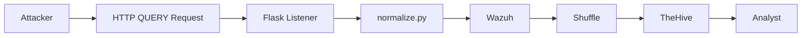
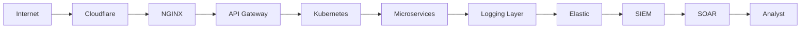
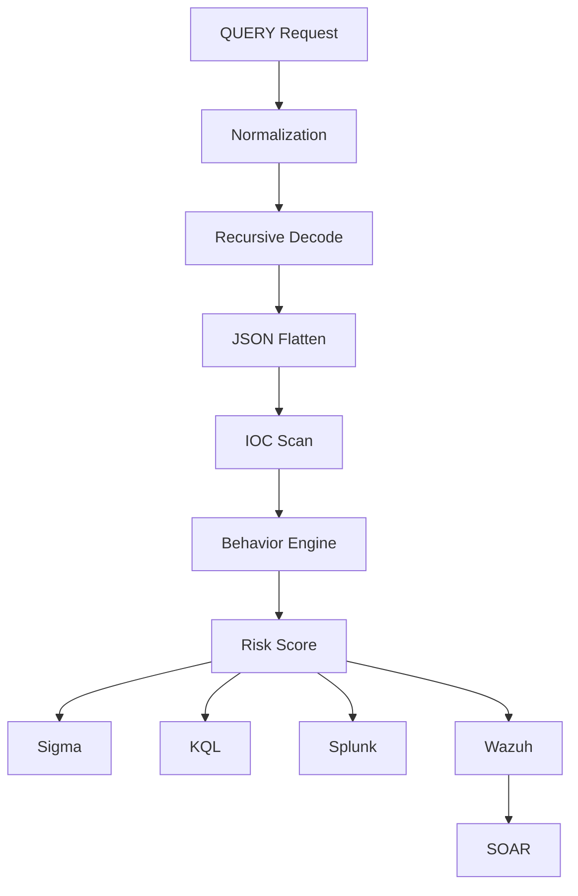
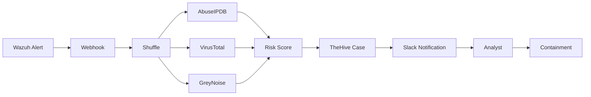
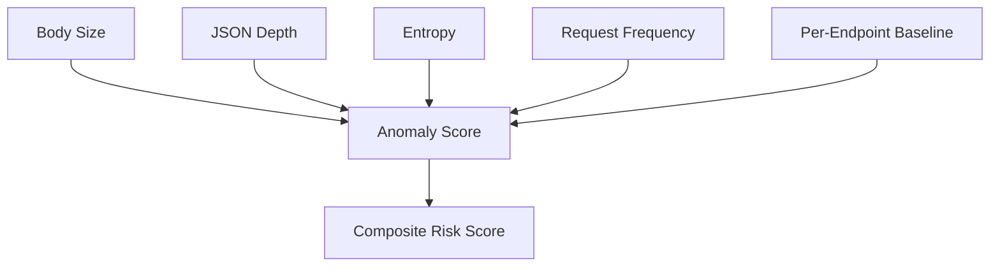

# Architecture

## 1. Current Lab Implementation

## 2. Enterprise Deployment Path

Shows where a QUERY request travels in a production environment, vs. the single-host lab setup above — the same normalize.py logic would sit as a sidecar/middleware at the API Gateway or ingress layer rather than a standalone Flask listener.

## 3. Detection Pipeline (Data Flow)

## 4. SOAR Workflow (PB-11)

Note: VirusTotal and GreyNoise enrichment nodes are roadmap items — current implementation uses AbuseIPDB only. See Roadmap in main README.

## 5. Behavior Model (Anomaly Scoring)

