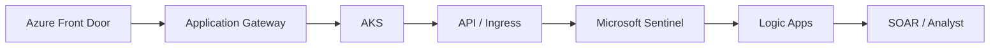
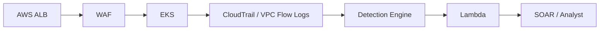

# Enterprise Deployment Reference

The lab implementation (see [ARCHITECTURE.md](ARCHITECTURE.md)) uses a single Flask
listener and a single-node Wazuh instance. This document sketches how the same
`normalize.py` → risk-score → SOAR logic would map onto two common cloud
deployment patterns. These are reference designs, not deployed infrastructure —
see the Honest Scope note in the main README.

## Azure Reference Path

Where `normalize.py` fits: as a sidecar container or ingress-level middleware
inside AKS, ahead of the application pods, so QUERY bodies are inspected before
they reach application code. Sentinel replaces Wazuh as the rule engine (KQL
rules already exist in `kql/` for this), and Logic Apps takes the role Shuffle
plays in the lab — receiving the Sentinel alert and driving the same
enrich → case → notify flow.

## AWS Reference Path

Where `normalize.py` fits: same sidecar/middleware pattern inside EKS. AWS WAF
can absorb some signature-level filtering at the edge, but the behavioral
scoring (entropy, nesting depth, per-endpoint baseline) still needs to happen
at the application layer, since WAF rules don't have request-history context.
Lambda takes the SOAR-trigger role Shuffle plays in the lab.

## What carries over unchanged

Regardless of cloud provider, the actual detection logic doesn't change:

- `src/normalize.py` — decoding, flattening, signature scan, risk scoring
- `sigma/` rules — vendor-neutral, convertible to Sentinel (KQL) or Splunk syntax
- The risk-score threshold contract (score >= 75 → auto-contain, lower →
  analyst queue) — this is a SOAR-layer decision, not a SIEM-specific one

What changes is only the ingestion point (ALB/App Gateway vs. a bare Flask
listener) and which managed SIEM/SOAR product receives the alert.

## Known gaps in this reference design

- No rate-limiting or WAF-layer response is specified here — this is a
  detection reference, not a full mitigation architecture
- Multi-region / multi-cluster QUERY traffic aggregation isn't addressed
- Neither path has been deployed or tested; see Honest Scope in the main README
