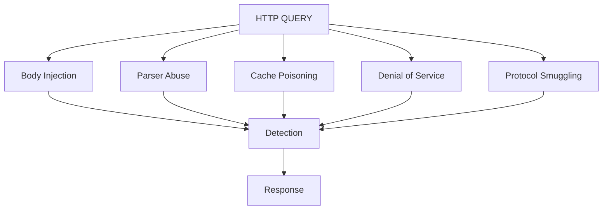

# Threat Model: HTTP QUERY Method

## Attack Surface

## Threat Descriptions

| Threat | Description | Current Coverage |
|---|---|---|
| Body injection | SQLi/NoSQLi/cmdi/traversal payloads carried in QUERY body | Covered — sigma/query_002, Wazuh rules 100201/100202 |
| Parser abuse | Deeply nested or oversized JSON intended to exhaust parsing resources | Covered — behavioral rule query_003, Wazuh rule 100204 |
| Cache poisoning | QUERY responses cached by intermediaries keyed incorrectly on body content | Not yet covered — roadmap item |
| Denial of service | High-volume or malformed QUERY floods | Partially covered — frequency baseline in behavior model, no rate-limiting response yet |
| Protocol smuggling | Inconsistent QUERY body framing between front-end proxy and back-end parser (request smuggling analog for the new method) | Not yet covered — roadmap item, requires proxy-level testing |

## MITRE ATT&CK Mapping

| Threat | MITRE Technique | Tactic | Detection Rule |
|---|---|---|---|
| Missing/non-compliant Content-Type | T1595 — Active Scanning | Reconnaissance | 100200 |
| SQL/command injection in body | T1190 — Exploit Public-Facing Application | Initial Access | 100201 |
| NoSQL/traversal injection | T1059 / T1083 — Command and Scripting Interpreter / File and Directory Discovery | Execution / Discovery | 100202 |
| Anomalous nesting/size (recon probing) | T1595.002 — Vulnerability Scanning | Reconnaissance | 100204 |

## Honest Gaps

Cache poisoning and protocol smuggling are named threats for QUERY specifically (a body-carrying "safe" method breaks assumptions some caches and proxies make about GET-like methods), but this repo does not yet have detection content for either. They're listed here deliberately, not hidden, per the same documented-limitations approach as the rest of this project.
